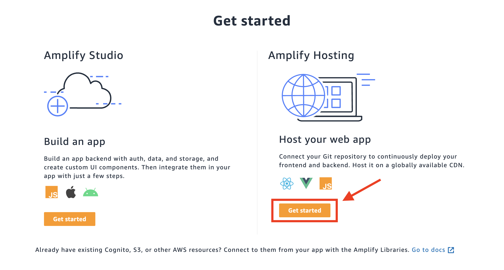
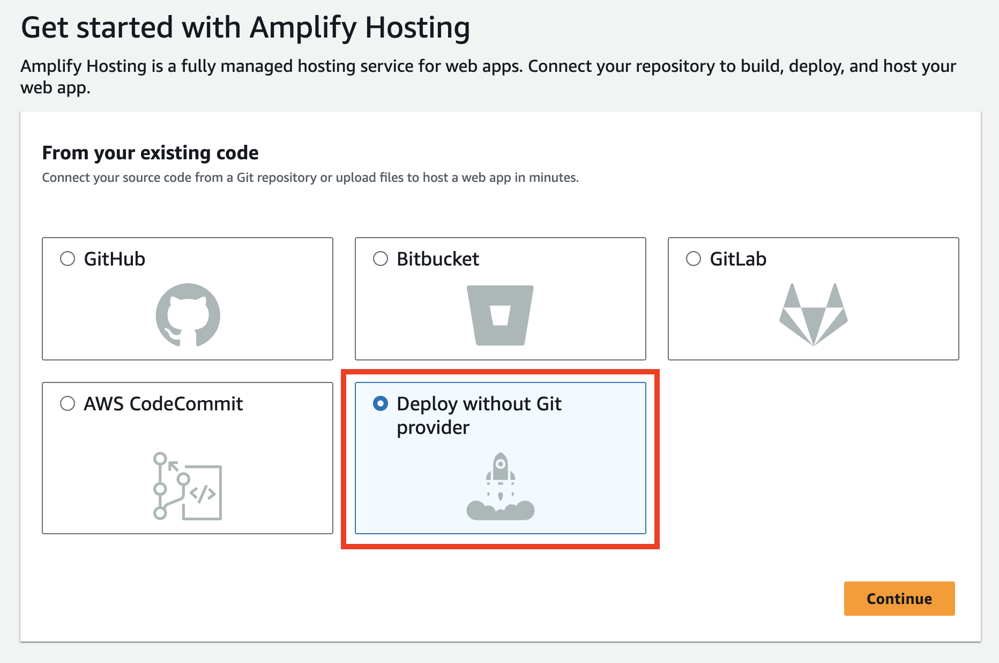
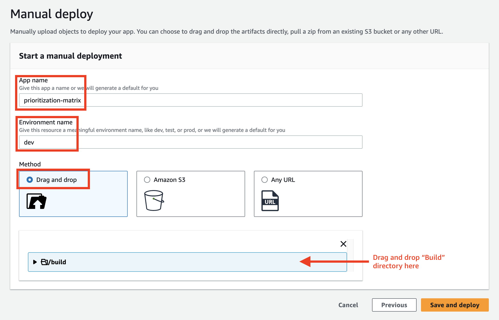
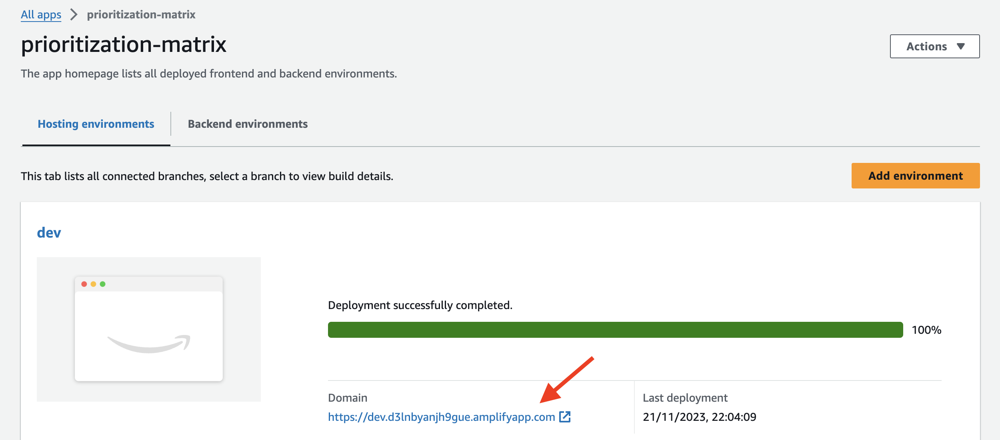
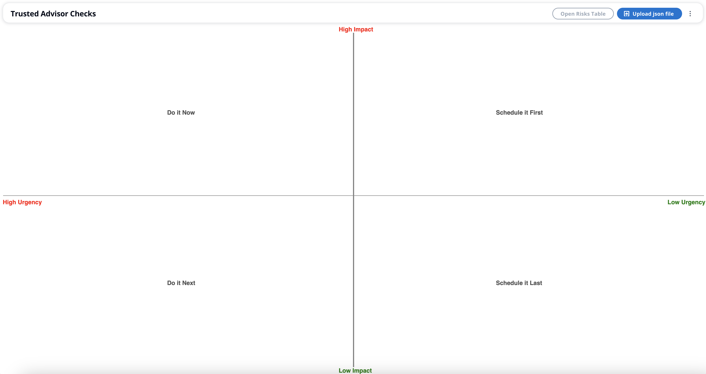
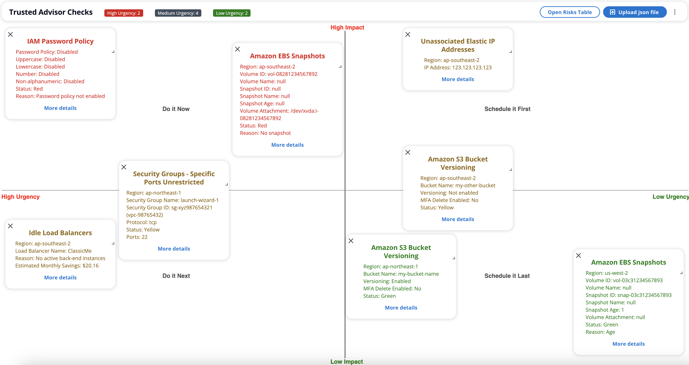

## Simple eisenhower matrix using react-grid for prioritizing AWS Well-Architected HRI

### Option 1 - Install and Run Locally

1. Clone the repository:
```
git clone https://github.com/carlos-aws/wa-hri-eisenhower.git

cd wa-hri-eisenhower
```

2. Install dependencies and start the application:
```
npm install

npm run start
```

3. Open in a web browser via: http://localhost:3000

### Option 2 - Host in AWS Amplify

1. Clone the repository:
```
git clone https://github.com/carlos-aws/wa-hri-eisenhower.git

cd wa-hri-eisenhower
```

2. Install dependencies and Build the application. After doing this, the ``/build`` directory will be created inside the current directory: 
```
npm install

npm run build
```

3. Open the [AWS Amplify Console](https://us-east-1.console.aws.amazon.com/amplify/home?region=us-east-1#/) and click on **"Get Started"** for using Amplify Hosting. Or, if this is not your first AWS Amplify app, click on **"New app" > "Host web app"**:



4. Select **Deploy without Git provider**:



5. In the **Manual deploy** page, fill in the **App name** and **Environment name** fields. For **Method**, select **"Drag and drop"**. Drag and drop the ``/build`` directory created before into the section, and click on **Save and deploy**:



6. Once the deployment is completed, click on the Domain link generated by Amplify to open the application:






